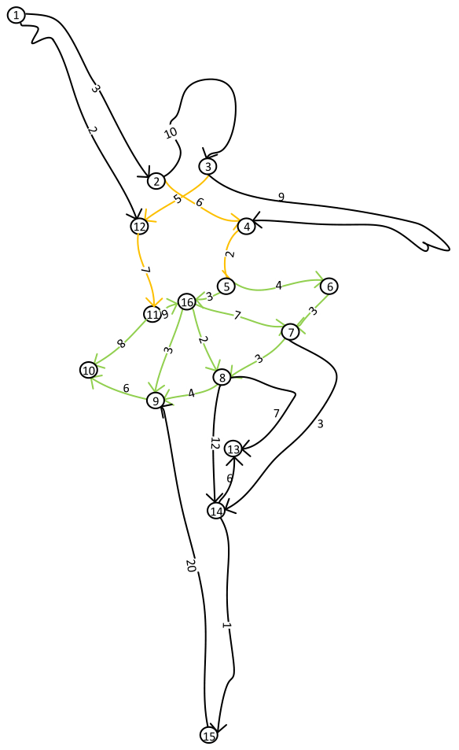

---
## Front matter
title: "Отчёт по Лабораторной Работе"
subtitle: "НКНбд-02-21"
subtitle: "Преподаватель: Доцент Маркова Е.В."
subtitle: "Алгоритм Дейкстры"

author: "Самигуллин Эмиль Артурович"

## Generic otions
lang: ru-RU
toc-title: "Содержание"

## Bibliography
bibliography: bib/cite.bib
csl: pandoc/csl/gost-r-7-0-5-2008-numeric.csl

## Pdf output format
toc: true # Table of contents
toc-depth: 2
fontsize: 12pt
linestretch: 1.5
papersize: a4
documentclass: scrreprt
## I18n polyglossia
polyglossia-lang:
name: russian
options:
- spelling=modern
- babelshorthands=true
polyglossia-otherlangs:
name: english
## I18n babel
babel-lang: russian
babel-otherlangs: english
## Fonts
mainfont: PT Serif
romanfont: PT Serif
sansfont: PT Sans
monofont: PT Mono
mainfontoptions: Ligatures=TeX
romanfontoptions: Ligatures=TeX
sansfontoptions: Ligatures=TeX,Scale=MatchLowercase
monofontoptions: Scale=MatchLowercase,Scale=0.9
## Biblatex
biblatex: true
biblio-style: "gost-numeric"
biblatexoptions:
- parentracker=true
- backend=biber
- hyperref=auto
- language=auto
- autolang=other*
- citestyle=gost-numeric
## Pandoc-crossref LaTeX customization
figureTitle: "Рис."
tableTitle: "Таблица"
listingTitle: "Листинг"
lofTitle: "Цель Работы"
lotTitle: "Ход Работы"
lolTitle: "Листинги"
## Misc options
indent: true
header-includes:
- \usepackage{indentfirst}
- \usepackage{float} # keep figures where there are in the text
- \floatplacement{figure}{H} # keep figures where there are in the text
--- 

# 1. Теоритические сведения по алгоритму Дейкстры

Для лабораторной работы использовалась лекция 6.

# 2. Реализация алгоритма Дейкстры на примере

Для реализации алгоритма Дейкстры нахождения кратчайшего пути от одной вершины до всех остальных на примере был выбран граф на ( рис. [-@fig:01])

{#fig:01 width=60%}

Для данного графа применен представленный ниже исходный код алгоритма Дейкстры поиск пути наименьшей длины, выполненный на языке программирования Java.

```java
public void ShortestPath(int src) {
        ArrayList<Integer> dist = new ArrayList<>();
        Boolean[] sptSet = new Boolean[V];

        for (int i = 0; i < V; i++){
            dist.add(Integer.MAX_VALUE);
            sptSet[i] = false;
        }

        dist.set(src, 0);

        for (int count = 0; count < V - 1; count++ ) {

            int index = minDistance(dist, sptSet);

            sptSet[index] = true;

            for (int v = 0; v < V; v++) {

                if (!sptSet[v] && (adj.get(index).get(v) != 0) && (dist.get(index) != Integer.MAX_VALUE)
                        && (dist.get(index) + adj.get(index).get(v) < dist.get(v))){
                    dist.set(v, dist.get(index) + adj.get(index).get(v));
                }

            }
        }

        printResult(dist, src);

    }

    private int minDistance(ArrayList<Integer> dist, Boolean[] sptSet){

        int min = Integer.MAX_VALUE, min_index = -1;

        for (int i = 0; i < V; i++){
            if (!sptSet[i] && dist.get(i) <= min){
                min = dist.get(i);
                min_index = i;
            }
        }

        return min_index;
    }
    
    private void printResult(ArrayList<Integer> dist, int src){
        System.out.println("\nShortest path from " + ++src + " to ");
        
        for (int i = 0; i < V; i++){
        System.out.println(i+1 + "\t\t" + dist.get(i) + "\t\t");
        }
    }
```

В результате алгоритма Дейкстры получается результат вида (пример из вершины 1)

```text
1  2   3  4   5   6   7   8   9  10  11  12  13  14  15  16
0  3  13  9  11  15  18  16  17  17   9   2  23  21  22  14
```

